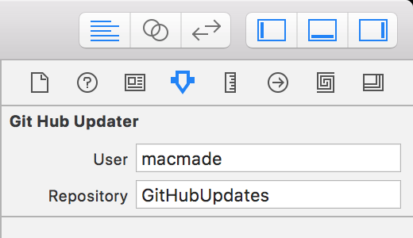

GitHubUpdates
=============

  

About
-----

**GitHubUpdates is Cocoa framework to install application updates from GitHub releases.**  
If you ever used [Sparkle](https://github.com/sparkle-project/Sparkle), this project provided the same kind of functionalities, but works with your GitHub releases and tags.

Documentation
-------------

Documentation and API reference can be found at: http://doc.xs-labs.com/GitHubUpdates/

How to use
----------

### Application Setup

The project provides a **Cocoa framework** that you can embed into your own application.  
A module is also defined, so you can either use:

    @import GitHubUpdates;
    
or:

    #import <GitHubUpdates/GitHubUpdates.h>

In order to check for updates, a `GitHubUpdater` object needs to be created:

    self.updater            = [ GitHubUpdater new ];
    self.updater.user       = @"MyGitHubUsername" 
    self.updater.repository = @"MyGitHubRepository";

Note that you can also create the `GitHubUpdater` instance with **InterfaceBuilder**.  
The `user` and `repository` properties are inspectable, so you can set them with the Interface Builder inspector palette.

You can then check for updates using the IB action:

    [ self.updater checkForUpdates: nil ];

This method will show a progress window, while checking for available updates.  
You can also choose to check for updates in background:

    [ self.updater checkForUpdatesInBackground ];

With this method, the update window will only be shown if an update is available.

You can also check for updates periodically, using a timer:

    [ NSTimer scheduledTimerWithTimeInterval: 3600 target: self.updater selector: @selector( checkForUpdatesInBackground ) userInfo: nil repeats: YES ];
    
This will check for updates every hour.

### Create a release on GitHub

**GitHubUpdates** will check your GitHub tags to see if an update is available.

Your tags should correspond to the application's version number, as in `CFBundleShortVersionString`.  
There's currently no support for `CFBundleVersion`.

Tags can be created on GitHub the following way:

    git tag 0.1.2 -m "0.1.2"
    git push origin --tags

Once you created a new tag, you'll need to upload a ZIP archive or a DMG file of your application to GitHub.  
Also note that your application should be at the first level of the ZIP archive or the DMG file.

Note that the installer will check the value of `CFBundleIdentifier`, so they need to match.

### Code-Signing

For obvious security reasons, the installer will also check code-signing properties.

While you can use **GitHubUpdates** without code-signing, the installer will refuse to install a non code-signed version, if the current version is code-signed.
Code-signing identities are also checked, and the installer will refuse to install an update if there's a mismatch in the code-signing identities.

License
-------

GitHubUpdates is released under the terms of the MIT license.

Repository Infos
----------------

    Owner:          Jean-David Gadina - XS-Labs
    Web:            www.xs-labs.com
    Blog:           www.noxeos.com
    Twitter:        @macmade
    GitHub:         github.com/macmade
    LinkedIn:       ch.linkedin.com/in/macmade/
    StackOverflow:  stackoverflow.com/users/182676/macmade
